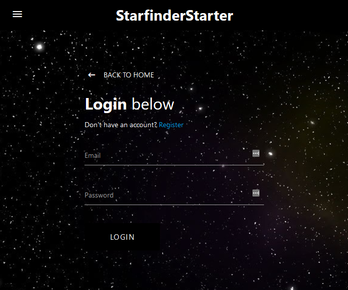
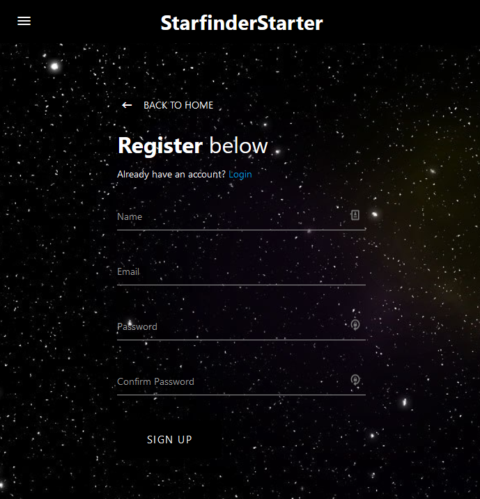
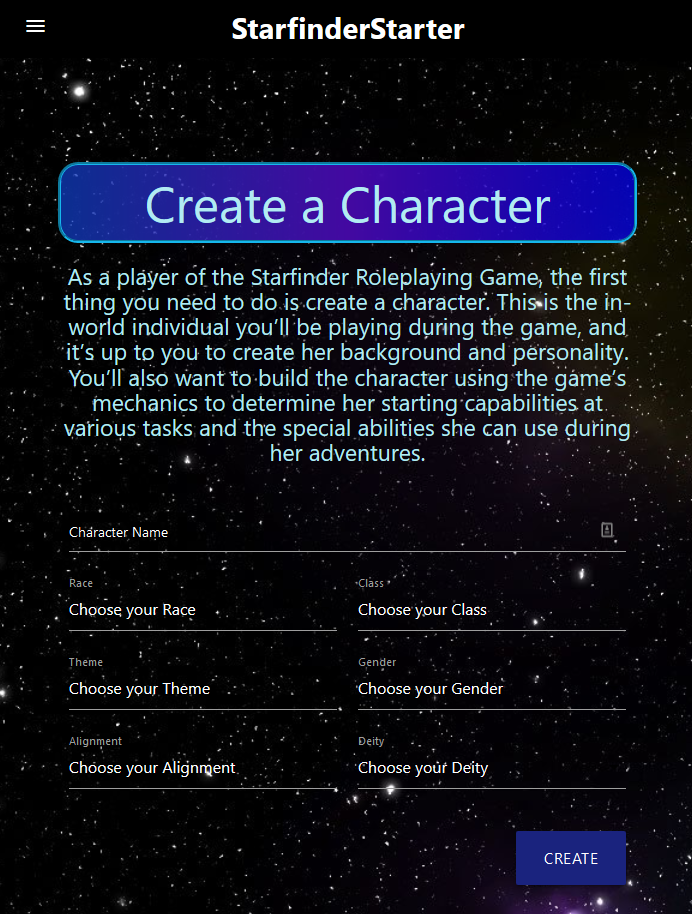
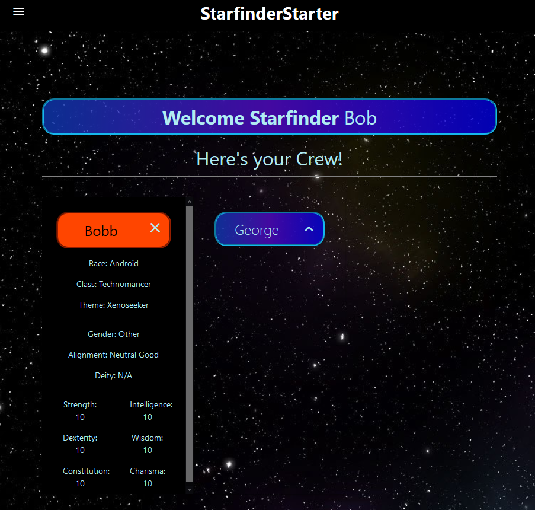

# StarfinderStarter
[](https://github.com/Auretus/DandD-Character-Generator/)

## Description

Starfinder Starter is an application that is meant for players of the Starfinder Roleplaying Game.

It is a combination of a quick-reference guide of the Player’s Handbook and a character creator that stores multiple characters on the app.

RPGs like Dungeons & Dragons, Pathfinder, Starfinder are all games that historically take a long time to get going. The most tedious part is getting all the characters together and the campaign rolling.

Starfinder Starter is here to make that process easy and painless, to get the game finally started!


## Table of Contents 

* [Installation](#installation)

* [Usage](#usage)

* [License](#license)

* [Screenshots](#screenshots)


## Installation

To install necessary dependencies, run the following command:

```
npm i
```

## Usage

npm run dev to start the application.

Once on the webpage, you can "Enlist" to create an account or "Login" if you already have one.
Once logged in, you can navigate to any of the pages on the navbar at the top left which will lead you to reference pages, or the top right which will let you create a character or lead you to page with all the characters you have created.


## License

MIT
  

## Screenshots
Login:



New User Registration



System Reference Guide


Character Creation



Roster

